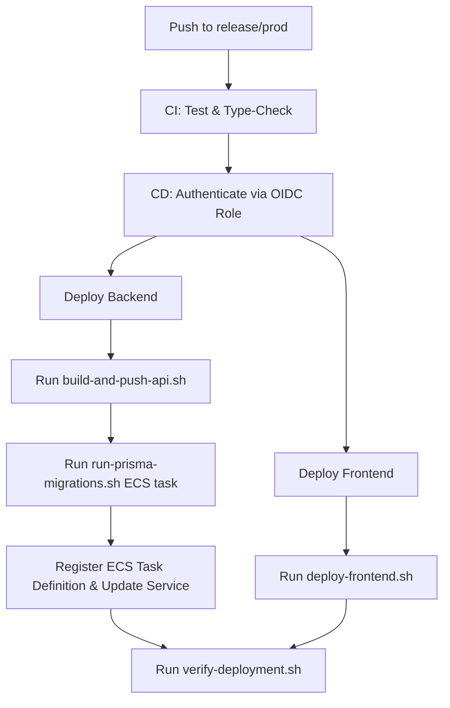

# CalTrack AWS Production Deployment Guide

This document describes the cloud architecture, service mapping, deployment procedures, and pre-flight checklists for hosting CalTrack on Amazon Web Services (AWS) using modern container and serverless patterns.

---

## 1. Cloud Architecture Overview

CalTrack's cloud deployment is divided into **Static Web Assets Hosting** (Edge CDN) and **Containerized REST API** (VPC Application cluster), backed by a managed relational database.

*   **VPC Layout**:
    *   **Public Subnets**: Application Load Balancers (ALBs) facing the internet.
    *   **Private Subnets**: ECS Fargate containers running the Express API service (no public IP addresses, egress traffic routed through NAT Gateways).
    *   **Isolated Database Subnets**: Amazon RDS PostgreSQL instance, inaccessible from the public internet.

---

## 2. AWS Service Responsibilities

### Frontend Hosting
*   **Amazon S3**: Hosts the compiled static React/TypeScript assets (`index.html`, Javascript, CSS, and media bundles). The bucket is configured with private access, allowing access only via Origin Access Control (OAC) from CloudFront.
*   **Amazon CloudFront (CDN)**: Caches static content globally at Edge locations. It handles SSL/TLS termination, custom domain routing, and forwards `/api/*` path queries directly to the Application Load Balancer.

### Application Logic (Backend)
*   **Amazon ECR (Elastic Container Registry)**: Private repository storing compiled Docker images for the backend `apps/api` application.
*   **Amazon ECS (Elastic Container Service) on AWS Fargate**: Serverless container execution engine. Fargate manages the OS patching, scaling, and provisioning, executing tasks in private subnets.
*   **Application Load Balancer (ALB)**: Performs SSL/TLS termination, routes external path requests, and conducts periodic health checks on active ECS tasks to ensure high availability.

### Storage & Security
*   **Amazon RDS (PostgreSQL)**: Fully-managed database engine with automated backups, patches, and Multi-AZ replication enabled for high availability and automated failovers.
*   **AWS Secrets Manager**: Vault for storing sensitive operational secrets (database passwords, JWT secret keys, LLM API keys) which are injected directly into ECS task definitions at startup, avoiding hardcoded values in container images.

---

## 3. Required Environment Variables

### ECS API Container (Apps/API Production Context)
| Variable | Injection Source | Purpose |
| :--- | :--- | :--- |
| `NODE_ENV` | Task Definition Static Env | Set to `production` to trigger JSON logging and strict validation. |
| `PORT` | Task Definition Static Env | Internal container listening port (usually `3001`). |
| `DATABASE_URL` | Secrets Manager String | PostgreSQL database connection string mapping RDS host parameters. |
| `JWT_SECRET` | Secrets Manager String | High-entropy random key used for authenticating JWT signatures. |
| `FRONTEND_URL` | Task Definition Static Env | Allowed CORS origin (maps the CloudFront domain URL). |

### S3 Web static assets (Apps/Web Production Context)
*   `VITE_API_URL`: Set to `/api` (relative path) so that all requests are proxied via CloudFront to the ALB, resolving CORS conflicts automatically.

---

## 4. Deployment Automation Scripts

CalTrack provides a set of automated bash scripts located in `scripts/aws/` to build, migrate, deploy, and verify the application. These scripts can be run locally or integrated directly into CI/CD pipelines.

### Setup Configuration

1. Copy the example configuration template to `.env.aws`:
   ```bash
   cp .env.aws.example .env.aws
   ```
2. Open `.env.aws` and customize it with your specific AWS account ID, resource names, and target URLs.

### Script Catalog

Each script is fully parameterized using environment variables with secure defaults and strict execution rules (`set -euo pipefail`).

| Script | Purpose | Execution | Package Script Shortcut |
| :--- | :--- | :--- | :--- |
| `create-ecr.sh` | Checks for the API ECR repository and creates it with security scanning and KMS encryption if missing. | `bash scripts/aws/create-ecr.sh` | N/A |
| `build-and-push-api.sh` | Builds the multi-stage Docker API container, authenticates to the ECR registry, tags it, and pushes it to ECR. | `bash scripts/aws/build-and-push-api.sh` | `npm run deploy:aws:api` |
| `run-prisma-migrations.sh` | Executes database schema migrations securely (direct SQL execution via VPN/SSH tunnel OR triggering a Fargate task). | `bash scripts/aws/run-prisma-migrations.sh` | `npm run deploy:aws:migrate` |
| `deploy-frontend.sh` | Compiles static React/Vite assets, synchronizes them to the S3 bucket, and triggers a CloudFront invalidation. | `bash scripts/aws/deploy-frontend.sh` | `npm run deploy:aws:web` |
| `verify-deployment.sh` | Pings the live frontend and API health check URLs to assert system responsiveness. | `bash scripts/aws/verify-deployment.sh` | `npm run deploy:aws:verify` |

### VPC Database Migration Strategies

The database migrations script (`run-prisma-migrations.sh`) supports two operational modes depending on network topology:

1. **Direct Tunnel Mode**: If a connection string is active in `DATABASE_URL` (such as via AWS Client VPN or an SSH tunnel through a bastion host to the private RDS subnet), the script runs migrations using the local CLI:
   ```bash
   export DATABASE_URL="postgresql://[USER]:[PASSWORD]@[RDS_ENDPOINT]:5432/[DB_NAME]?schema=public"
   npm run deploy:aws:migrate
   ```
2. **ECS Fargate Isolation Mode**: If `DATABASE_URL` is omitted and `RUN_MIGRATION_ON_ECS=true` is set, the script launches a one-off ECS Fargate task inside the private subnets. This task shares the container image and has direct network access to the RDS database.
   ```bash
   export RUN_MIGRATION_ON_ECS=true
   export SUBNETS=subnet-12345,subnet-67890
   export SECURITY_GROUPS=sg-12345
   npm run deploy:aws:migrate
   ```

---

## 5. GitHub Actions CI/CD Deployment Process

Deployments are automated on pushes to the `release/prod` branch. The pipeline uses the automation scripts in a secure sandbox context:



---

## 6. Pre-Flight Deployment Checklist

- [ ] **Config Check**: Ensure `.env.aws` contains correct account parameters.
- [ ] **Secret Validation**: Ensure all production databases, API keys, and JWT keys are active inside AWS Secrets Manager.
- [ ] **ECR Prep**: Run `bash scripts/aws/create-ecr.sh` to ensure target ECR repository exists.
- [ ] **Database Connectivity**: Verify you can resolve host routes to RDS or set up security parameters for ECS-based migration tasks.
- [ ] **OIDC IAM Role**: Verify GitHub Actions repository has IAM permissions to assume the deployer role in AWS.
- [ ] **DNS Mapping**: Confirm Route 53 domain pointers are successfully mapped to the CloudFront CDN endpoint.
- [ ] **AWS Budget Alerts**: Configure budget monitors on the AWS account to prevent cost spikes.

---

## 7. Deployment Rollback Checklist

If a deployment fails, exhibits degraded health metrics, or fails to pass the `verify-deployment.sh` validation checks, follow this procedure:

### Backend Service Rollback
1. Navigate to **AWS ECS Console** > **CalTrack Cluster** > **API Service**.
2. Update the service to use the previous stable task definition revision (e.g. change task definition parameter from `caltrack-api:15` to `caltrack-api:14`).
3. Force a new deployment. ECS Fargate will spin up tasks running the stable image, verify health status, and gracefully terminate the degraded tasks.

### Frontend Static Rollback
1. Navigate to the local build directory or GitHub Actions artifacts to locate the previous stable build zip.
2. Clear the S3 bucket assets:
   ```bash
   aws s3 rm s3://caltrack-prod-assets/ --recursive
   ```
3. Upload the previous stable build to S3:
   ```bash
   aws s3 cp dist/ s3://caltrack-prod-assets/ --recursive
   ```
4. Create a CloudFront invalidation path `/*` to clear Edge caches:
   ```bash
   aws cloudfront create-invalidation --distribution-id <id> --paths "/*"
   ```
