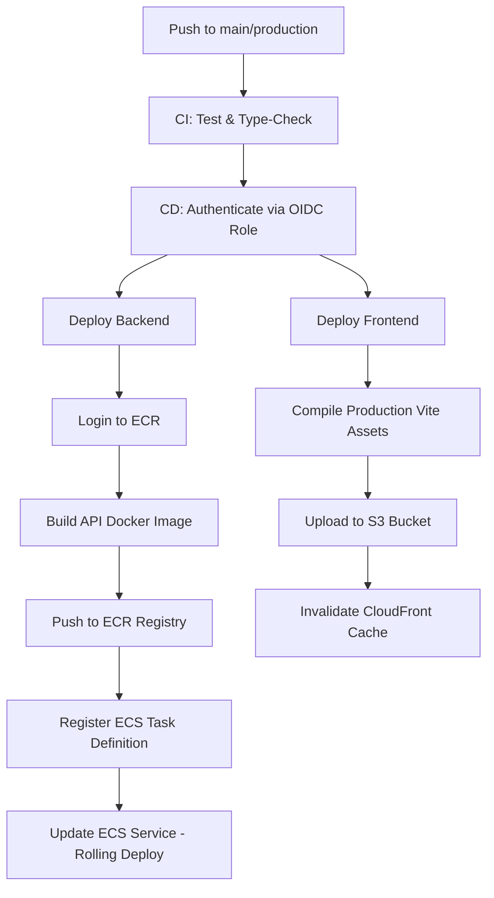

# CalTrack AWS Production Deployment Guide

This document describes the cloud architecture, service mapping, deployment procedures, and pre-flight checklists for hosting CalTrack on Amazon Web Services (AWS) using modern container and serverless patterns.

---

## 1. Cloud Architecture Overview

CalTrack's cloud deployment is divided into **Static Web Assets Hosting** (Edge CDN) and **Containerized REST API** (VPC Application cluster), backed by a managed relational database.

*   **VPC Layout**:
    *   **Public Subnets**: Application Load Balancers (ALBs) facing the internet.
    *   **Private Subnets**: ECS Fargate containers running the Express API service (no public IP addresses, egress traffic routed through NAT Gateways).
    *   **Isolated Database Subnets**: Amazon RDS PostgreSQL instance, inaccessible from the public internet.

---

## 2. AWS Service Responsibilities

### Frontend Hosting
*   **Amazon S3**: Hosts the compiled static React/TypeScript assets (`index.html`, Javascript, CSS, and media bundles). The bucket is configured with private access, allowing access only via Origin Access Control (OAC) from CloudFront.
*   **Amazon CloudFront (CDN)**: Caches static content globally at Edge locations. It handles SSL/TLS termination, custom domain routing, and forwards `/api/*` path queries directly to the Application Load Balancer.

### Application Logic (Backend)
*   **Amazon ECR (Elastic Container Registry)**: Private repository storing compiled Docker images for the backend `apps/api` application.
*   **Amazon ECS (Elastic Container Service) on AWS Fargate**: Serverless container execution engine. Fargate manages the OS patching, scaling, and provisioning, executing tasks in private subnets.
*   **Application Load Balancer (ALB)**: Performs SSL/TLS termination, routes external path requests, and conducts periodic health checks on active ECS tasks to ensure high availability.

### Storage & Security
*   **Amazon RDS (PostgreSQL)**: Fully-managed database engine with automated backups, patches, and Multi-AZ replication enabled for high availability and automated failovers.
*   **AWS Secrets Manager**: Vault for storing sensitive operational secrets (database passwords, JWT secret keys, LLM API keys) which are injected directly into ECS task definitions at startup, avoiding hardcoded values in container images.

---

## 3. Required Environment Variables

### ECS API Container (Apps/API Production Context)
| Variable | Injection Source | Purpose |
| :--- | :--- | :--- |
| `NODE_ENV` | Task Definition Static Env | Set to `production` to trigger JSON logging and strict validation. |
| `PORT` | Task Definition Static Env | Internal container listening port (usually `3001`). |
| `DATABASE_URL` | Secrets Manager String | PostgreSQL database connection string mapping RDS host parameters. |
| `JWT_SECRET` | Secrets Manager String | High-entropy random key used for authenticating JWT signatures. |
| `FRONTEND_URL` | Task Definition Static Env | Allowed CORS origin (maps the CloudFront domain URL). |

### S3 Web static assets (Apps/Web Production Context)
*   `VITE_API_URL`: Set to `/api` (relative path) so that all requests are proxied via CloudFront to the ALB, resolving CORS conflicts automatically.

---

## 4. GitHub Actions CI/CD Deployment Process

Deployments are automated on pushes to the `main` or `production` branch.

---

## 5. Pre-Flight Deployment Checklist

- [ ] **Secret Validation**: Ensure all production databases, API keys, and JWT keys are active inside AWS Secrets Manager.
- [ ] **Prisma Migration**: Run `npx prisma db push` or equivalent container migration task on RDS before updating the ECS task.
- [ ] **OIDC IAM Role**: Verify GitHub Actions repository has IAM permissions to assume the deployer role in AWS.
- [ ] **DNS Mapping**: Confirm Route 53 domain pointers are successfully mapped to the CloudFront CDN endpoint.
- [ ] **AWS Budget Alerts**: Configure budget monitors on the AWS account to prevent cost spikes.

---

## 6. Deployment Rollback Checklist

If a deployment fails, exhibits degraded health metrics, or fails to start, follow this procedure:

### Backend Service Rollback
1.  Navigate to **AWS ECS Console** > **CalTrack Cluster** > **API Service**.
2.  Update the service to use the previous stable task definition revision (e.g. change task definition parameter from `caltrack-api:15` to `caltrack-api:14`).
3.  Force a new deployment. ECS Fargate will spin up tasks running the stable image, verify health status, and gracefully terminate the degraded tasks.

### Frontend Static Rollback
1.  Navigate to the local build directory or GitHub Actions artifacts to locate the previous stable build zip.
2.  Clear the S3 bucket assets: `aws s3 rm s3://caltrack-prod-assets/ --recursive`.
3.  Upload the previous stable build to S3: `aws s3 cp dist/ s3://caltrack-prod-assets/ --recursive`.
4.  Create a CloudFront invalidation path `/*` to clear Edge caches: `aws cloudfront create-invalidation --distribution-id <id> --paths "/*"`.
