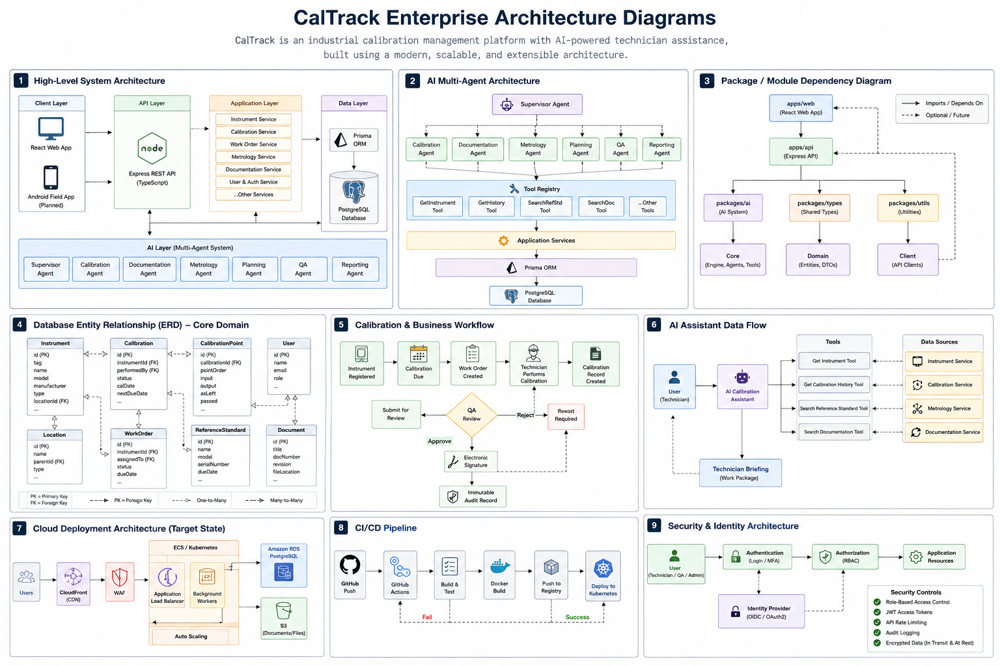
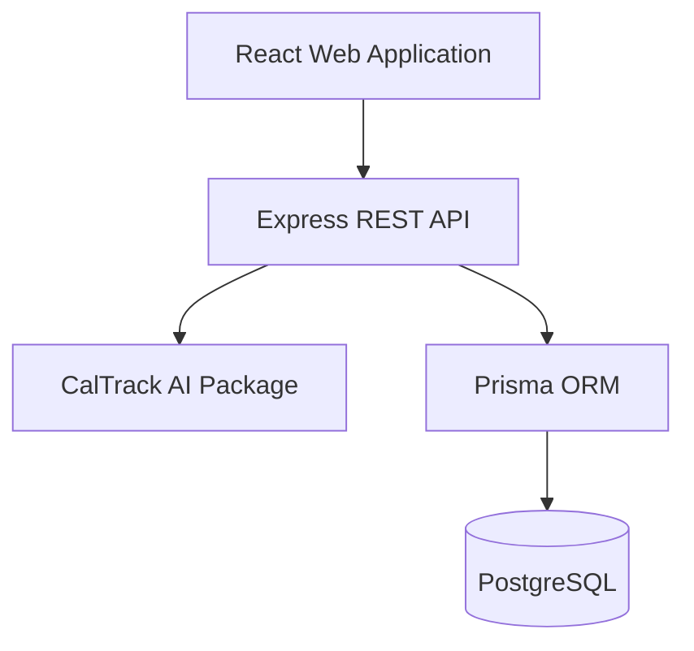
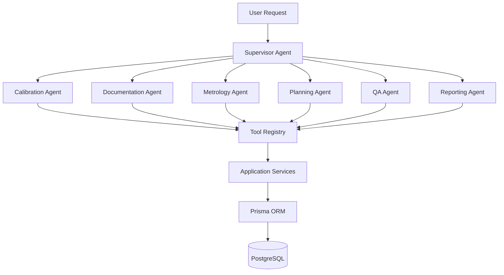
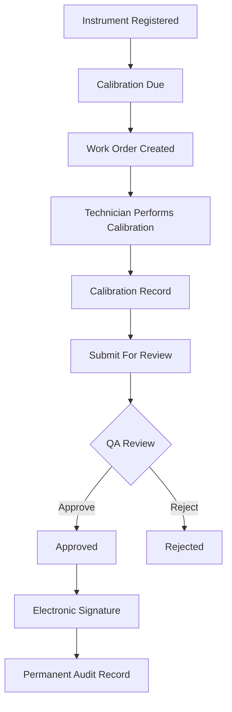
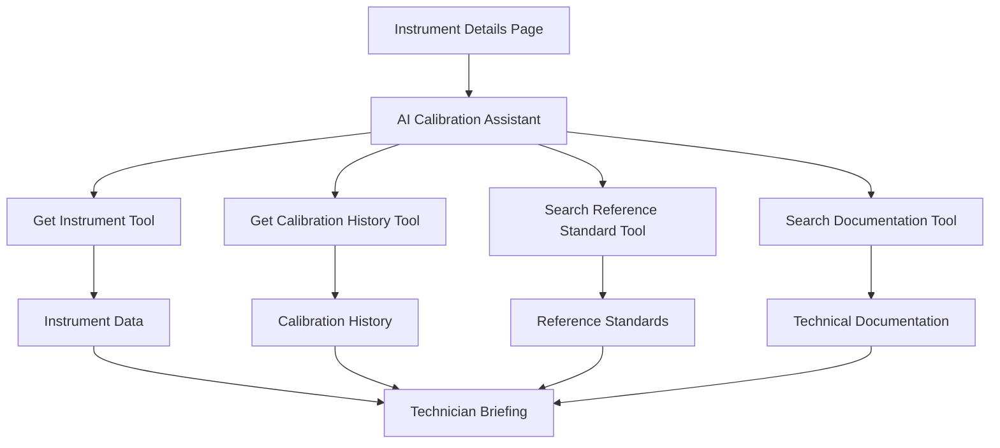

# CalTrack System Diagrams

## Enterprise Architecture Overview

---

# Overall System Architecture

---

# AI Multi-Agent Architecture

---

# Calibration Workflow

---

# AI Calibration Assistant Workflow

